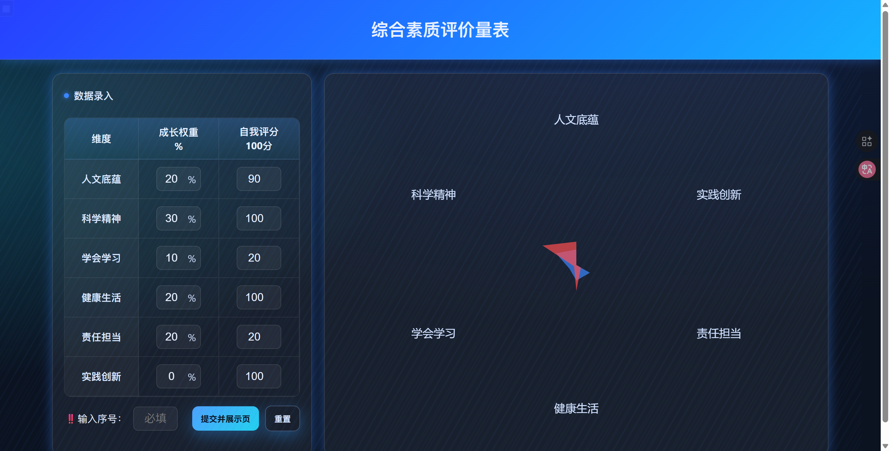
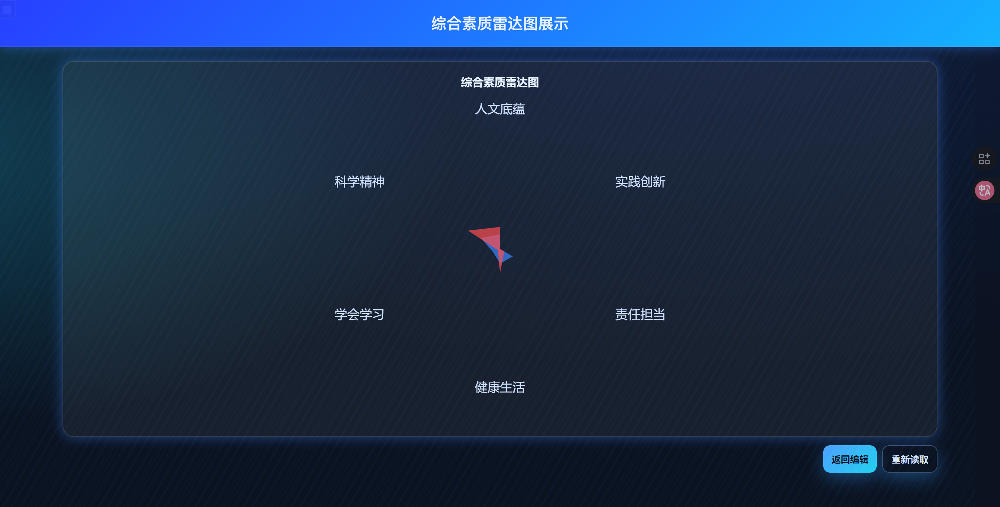
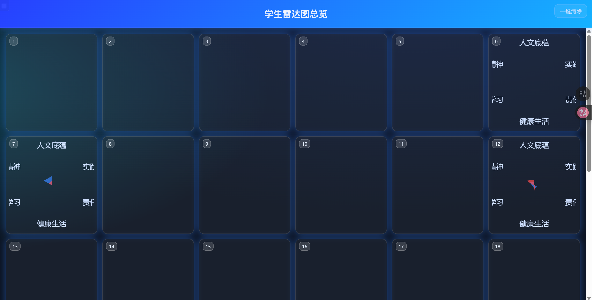

# 评价雷达（evaluation-radar）

一个基于 ECharts 的“综合素质雷达图”小工具，包含：
- 学生端：填写 6 个维度的分数与成长权重（权重总和需为 100%），实时渲染雷达图并提交。
- 展示页：单个学生的展示页，便于投屏或大屏展示。
- 教师端：30 宫格看板（按学号 1..30 占位），支持 WebSocket 实时更新与一键清空。
- 轻量 Node.js 服务：提供静态托管、REST 接口与 WebSocket 推送（内存存储）。

## 快速开始

- 运行环境：Node.js 18+（建议 18 或以上）
- 安装依赖并启动服务：
  - `npm install`
  - `npm start`
- 访问页面：
  - 学生端：`http://localhost:3000/student_pages/index.html`
  - 展示页：`http://localhost:3000/student_pages/display.html?id=<提交后自动生成的id>`
  - 教师端：`http://localhost:3000/teacher_show/index.html`

提示：
- 服务启动后会托管项目根目录的静态文件，因此无需额外前端构建步骤。
- 页面使用 jsDelivr 的 ECharts CDN，请保证可以访问外网以加载脚本。
- 教师端依赖服务端的 WebSocket（`/ws`）与接口；若只在单机本地使用，也可不启服务，仅用本地存储完成一次性展示，但多设备联动与清空功能将不可用。

## 使用流程

1) 学生端填写
- 打开学生端页面，依次录入 6 个维度的“成长权重(%)”与“自我分数(0–100)”。
- 权重合计必须等于 100% 才能提交。
- 请输入“学号”（1..30），用于在教师端看板定位到相应卡片位置。
- 点击“提交到展示页”后：
  - 本地会保存一份提交数据（localStorage，键名 `radarPayload:<id>`）。
  - 页面会跳转至展示页；若服务端可用，同时会向服务端 `POST /api/submit`，并通过 WebSocket 推送到教师端。

2) 展示页查看
- 展示页会根据 URL 中的 `id` 从本地存储读取数据并渲染两层雷达：
  - 成长权重（由权重换算得到）
  - 自我评价（由“分数×权重”得到的加权值）
- 支持“返回编辑”“重新读取”。

3) 教师端看板
- 默认 6 列 × 5 行，共 30 个卡位（学号 1..30）。
- 支持从服务端预加载历史（`GET /api/list`）并通过 WebSocket 实时接收新提交。
- 点击缩略图可放大到弹窗查看；右上角“⼀键清空”可清除：
  - 教师端内存状态（调用 `POST /api/clear`）
  - 浏览器本地存储中所有 `radarPayload:*` 项（当前设备）

## 目录结构

- `student_pages/index.html` 学生端录入与预览提交
- `student_pages/display.html` 单人展示页
- `teacher_show/index.html` 教师端看板（30 宫格 + 放大）
- `server/server.js` 轻量服务（Express + ws），静态托管/REST/WebSocket
- `package.json` 启动脚本与依赖
- `require/` 需求材料（word 文档及解包内容，仅参考）

## 接口与数据

- WebSocket：`/ws`
  - 服务向所有连接推送 `{ type: 'payload', data }`（有新提交）或 `{ type: 'clear' }`（清空）。

- REST 接口：
  - `POST /api/submit`
    - Body(JSON)：`{ id, sid, title, tag, dims[6], scores[6], weights[6], weighted[6], submittedAt }`
    - 校验：`dims/scores/weights` 均为等长数组，长度>0；`id` 必填。
  - `GET /api/list`
    - 返回服务内存中已提交的数据（按 `submittedAt` 升序）。
  - `POST /api/clear`
    - 清空内存存储并广播 `clear`。

- 存储：
  - 服务端：进程内存 Map，不持久化（重启即清空）。
  - 客户端：localStorage，用于展示页回读与在无服务端时的本地预览。

## 部署与多设备

- 单机演示：本机 `npm start` 后，直接在同一台机器的浏览器访问上述页面即可。
- 局域网联动：
  - 启动服务的电脑需与其他设备在同一网络。
  - 以该电脑的局域网 IP 替换 `localhost` 访问，例如 `http://192.168.x.x:3000/teacher_show/index.html`。
  - 教师端与学生端都访问同一地址，即可通过 WebSocket 实时联动。

## 常见问题

- 无法提交：请确认成长权重之和等于 100%。
- 卡位无显示：请确认填写了学号（1..30），并与教师端看板的卡位对应。
- 图表不显示或脚本报错：请检查外网连接以加载 ECharts CDN。
- 数据消失：服务端为内存存储，重启或清空会丢失历史；如需持久化，请扩展 `server.js` 写入数据库。

## 开发与二次扩展

- 服务端位于 `server/server.js`，结构简单，便于加持久化或鉴权。
- 页面为纯静态 HTML + 原生 JS，无构建依赖，易于按需改版（如维度名称/数量、配色、布局等）。

